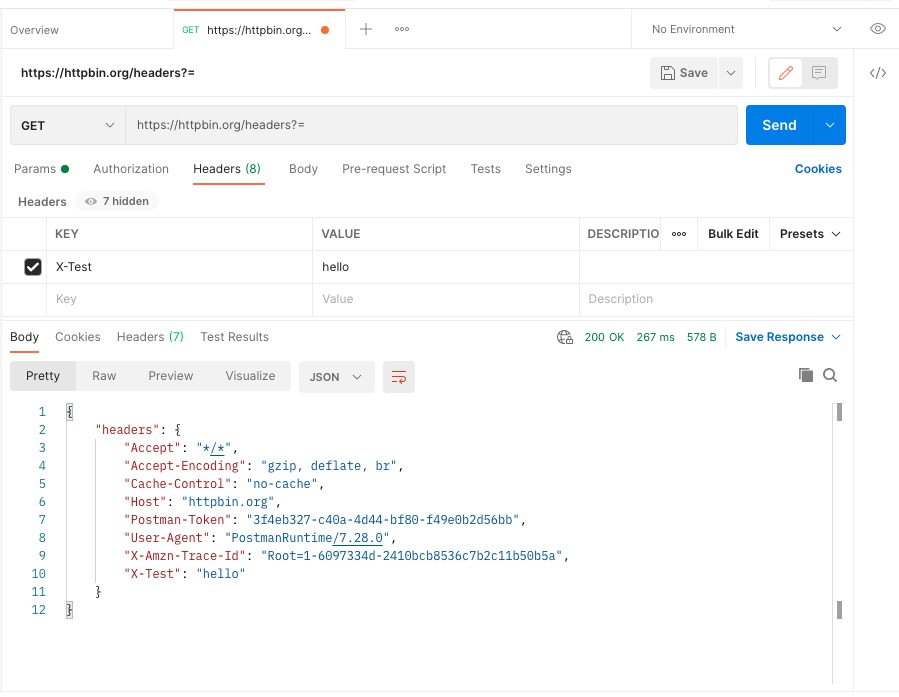
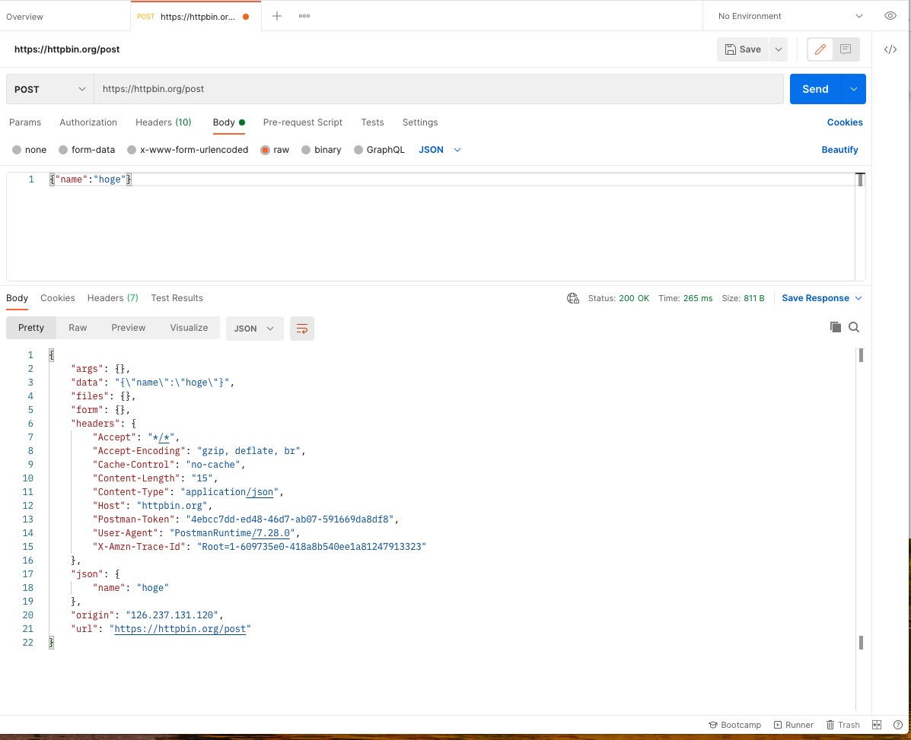
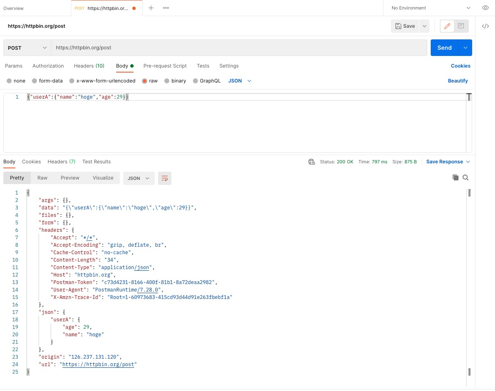
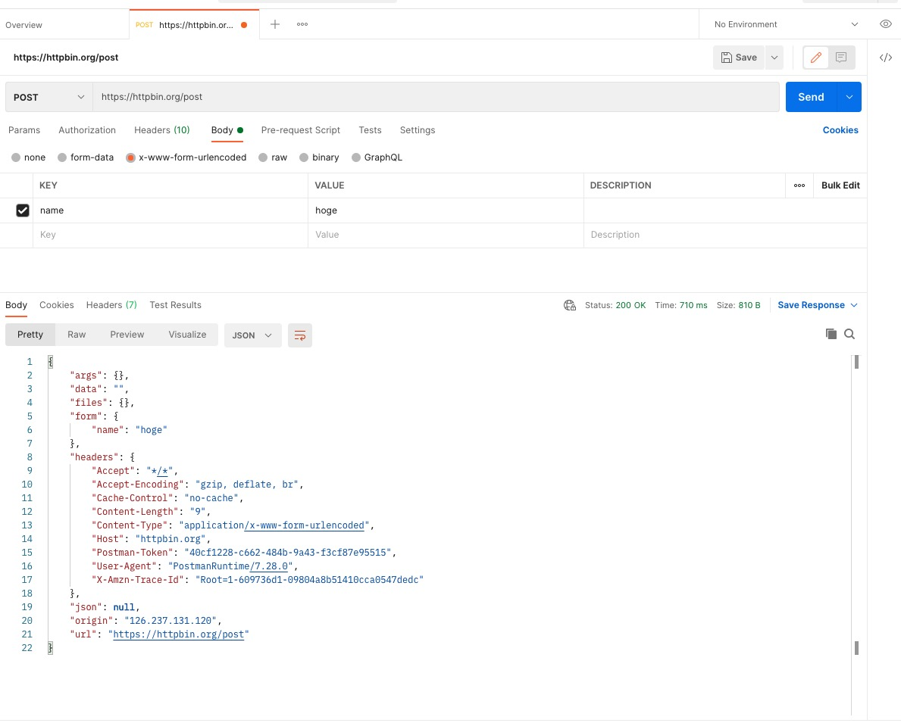

# 【回答】curl と postman に慣れる

課題については、Airtable にアクセスして頂き、「curl と postman に慣れる」をご確認願います。 https://airtable.com/tblg8ePOEQRDtIGiY/viwV3pAlEvPOOgmHF?blocks=hide

## (curl)回答 1 カスタムヘッダーを加える（X-Test='hello'）

curl コマンド

```
curl -X GET "https://httpbin.org/headers" -H "X-Test : hello"
```

レスポンス結果

```
{
  "headers": {
    "Accept": "*/*",
    "Host": "httpbin.org",
    "User-Agent": "curl/7.67.0",
    "X-Amzn-Trace-Id": "Root=1-60966c0e-17d00c26714563c15c97ae8f",
    "X-Test": "hello"
  }
}
```

## (curl)回答 2

Content-Type は"application/json"
method は POST
body は {"name": "hoge"}

curl コマンド

```
curl -X POST "https://httpbin.org/post" -H "accept: application/json" -H "Content-Type: application/json" --data '{"name":"hoge"}'
```

レスポンス結果

```
  "args": {},
  "data": "{\"name\":\"hoge\"}",
  "files": {},
  "form": {},
  "headers": {
    "Accept": "application/json",
    "Content-Length": "15",
    "Content-Type": "application/json",
    "Host": "httpbin.org",
    "User-Agent": "curl/7.67.0",
    "X-Amzn-Trace-Id": "Root=1-60966ad0-0be96c54487afdac5e9b9097"
  },
  "json": {
    "name": "hoge"
  },
  "origin": "126.237.131.120",
  "url": "https://httpbin.org/post"
}
```

## (curl)回答 3

以下のオブジェクト body に含めて送信する。
{userA: {name: "hoge", age: 29}}

curl コマンド

```
curl -X POST "https://httpbin.org/post" -H "accept: application/json" -H "Content-Type: application/json" --data '{"userA":{"name":"hoge","age":29}}'
```

レスポンス結果

```
{
  "args": {},
  "data": "{\"userA\":{\"name\":\"hoge\",\"age\":29}}",
  "files": {},
  "form": {},
  "headers": {
    "Accept": "application/json",
    "Content-Length": "34",
    "Content-Type": "application/json",
    "Host": "httpbin.org",
    "User-Agent": "curl/7.67.0",
    "X-Amzn-Trace-Id": "Root=1-609670f4-2719530b4aa88c6963a468ec"
  },
  "json": {
    "userA": {
      "age": 29,
      "name": "hoge"
    }
  },
  "origin": "126.237.131.120",
  "url": "https://httpbin.org/post"
}
```

## (curl)回答 4

Content-Type は application/x-www-form-urlencoded で name=hoge を送信する。

curl コマンド

```
curl -X POST "https://httpbin.org/post" -H "accept: application/json" -H "Content-Type: application/x-www-form-urlencoded" --data '{"name":"hoge"}'
```

レスポンス結果

```
{
  "args": {},
  "data": "",
  "files": {},
  "form": {
    "{\"name\":\"hoge\"}": ""
  },
  "headers": {
    "Accept": "application/json",
    "Content-Length": "15",
    "Content-Type": "application/x-www-form-urlencoded",
    "Host": "httpbin.org",
    "User-Agent": "curl/7.67.0",
    "X-Amzn-Trace-Id": "Root=1-60972782-57be57c90426465e2177b00f"
  },
  "json": null,
  "origin": "126.237.131.120",
  "url": "https://httpbin.org/post"
}
```

## (postman)回答 1 カスタムヘッダーを加える（X-Test='hello'）



## (postman)回答 2

Content-Type は"application/json"
method は POST
body は {"name": "hoge"}



## (postman)回答 3

以下のオブジェクト body に含めて送信する。
{userA: {name: "hoge", age: 29}}



## (postman)回答 4

Content-Type は application/x-www-form-urlencoded で name=hoge を送信する。



## curl に関するクイズ

以下のリクエストを curl コマンドで httpbin に送信してください  
Content-Type は"application/json"  
method は POST  
body は {"info":{"system":"1"},"data":{"no":"123","code":"000", "name":"hoge"}}  
URL はhttps://httpbin.org/post

## postman に関するクイズ

以下のリクエストを curl コマンドで httpbin に送信してください  
Content-Type は"application/json"  
method は POST  
body は {"info":{"system":"1"},"data":{"no":"123","code":"000", "name":"hoge"}}  
URL はhttps://httpbin.org/post
