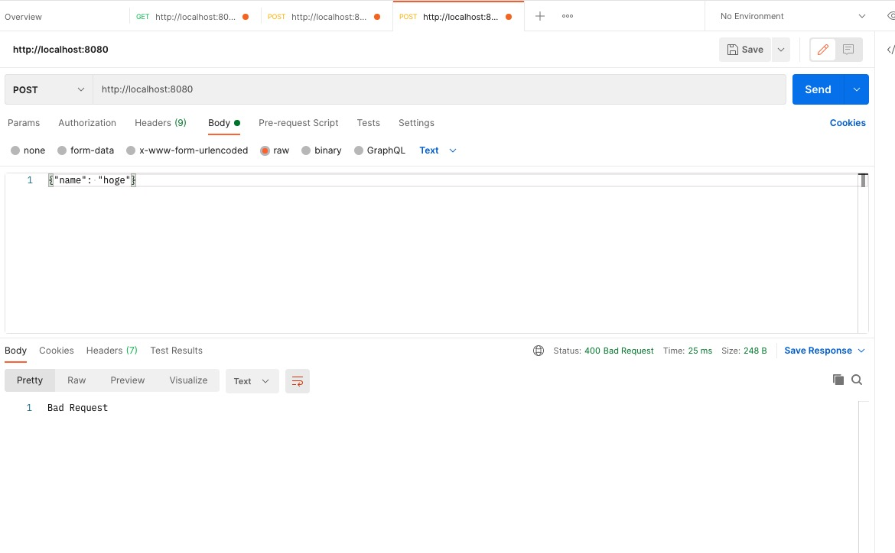

# 【回答】リクエストをパースする WEB サーバを作ってみる

課題については、Airtable にアクセスして頂き、「リクエストをパースする WEB サーバを作ってみる」をご確認願います。 https://airtable.com/tblg8ePOEQRDtIGiY/viwV3pAlEvPOOgmHF?blocks=hide

## 課題 1 node.js と express で WEB サーバをローカル環境に構築

Node.js をインストールした状態で以下のコマンドを実行すると Express で Web サーバーをローカル環境に構築できます。

```
cd myapp
npm init
npm install express
node app.js
```

## curl コマンドによる動作検証

- GET リクエスト正常系の検証

curl コマンド

```
curl localhost:8080 -H "Content-Type: application/json"
```

レスポンス結果

```
{"text":"hello world"}
```

- POST リクエスト正常系の検証

curl コマンド

```
curl localhost:8080 -d '{"name": "hoge"}' -H "Content-Type: application/json"
```

レスポンス結果

```
{"name":"hoge"}
```

- POST リクエスト異常系の検証

curl コマンド

```
curl localhost:8080 -d '{"name": "hoge"}'
```

レスポンス結果

```
Bad Request
```

## postman による動作検証

- GET リクエスト正常系の検証


- POST リクエスト正常系の検証


- POST リクエスト異常系の検証



## 課題 2 に対する回答

Content-type に application/x-www-form-urlencoded を指定した時と、application/json を指定した時で、送信されるデータ形式がどのように異なるのか説明してください

application/x-www-form-urlencoded を指定した場合、クエリパラメータ形式でデータが送信されます。

```
Name=John+Smith&Age=23
```

application/json を指定した場合、JSON 形式でデータが送信されます。

```
{ Name : 'John Smith', Age: 23}
```
